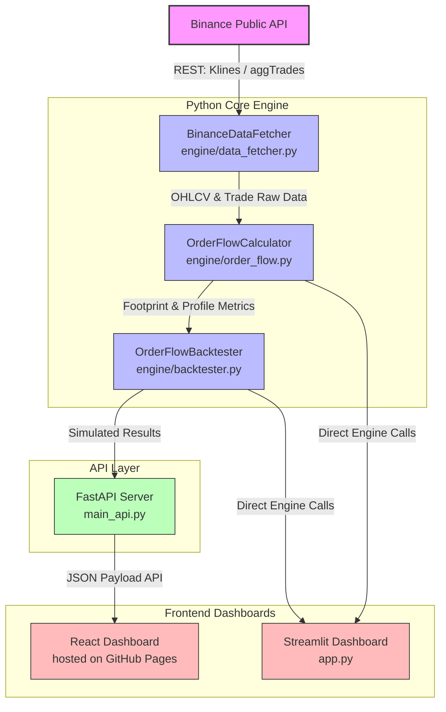

# 📊 Trader Dale - Order Flow & Trading Suite

A comprehensive, professional-grade order flow trading suite designed for analyzing and backtesting high-probability setups (optimized for XRP/USDT and other highly volatile assets).

This repository contains the complete trading ecosystem:
1. **Core Order Flow Engine**: Python library for footprint profiles, imbalance calculation, and backtesting.
2. **React Dashboard**: Modern Vite-based single-page application with rich interactive analytics.
3. **Streamlit App**: Interactive, lightweight dashboard for quick backtests and visualizations.
4. **FastAPI Backend**: High-performance API server powering the React dashboard.
5. **Pine Script Strategy**: Fully-optimized TradingView Pine Script for real-time alerts.

---

## 📂 Project Architecture

```
.
├── app.py                  # Standalone Streamlit dashboard
├── main_api.py             # FastAPI backend server
├── main.py                 # Standalone CLI entrypoint (live monitor / backtest)
├── Order_Flow_Strategy.pine# TradingView Pine Script code
├── engine/                 # Core Python calculations & logic
│   ├── data_fetcher.py     # Binance API client
│   ├── order_flow.py       # Footprint/POC/Value Area calculator
│   ├── backtester.py       # Historical trade backtesting simulator
│   └── monitor.py          # WebSocket live monitoring engine
└── dashboard/              # React + TypeScript + Vite frontend
    ├── src/                # UI components & charting
    └── package.json        # Node.json config & scripts
```

---

## 📊 Data Flow & Architecture

The diagrams below demonstrate how data flows through the application layers:



### Steps of Execution Flow:
1. **Data Ingestion**: `BinanceDataFetcher` fetches historical OHLCV candles (klines) and aggregate transaction records directly from Binance's API endpoints.
2. **Profile & footprint Calculations**: `OrderFlowCalculator` filters transaction blocks, rounds prices to tick size, builds footprint grids (Bids vs. Asks), and calculates Point of Control (POC), Value Area (VAH/VAL), and buying/selling imbalances (based on configured imbalance ratios).
3. **Execution & Backtesting**: The engine aggregates footprint calculations to execute simulated entries and exits using target risk limits and ATR-based stops.
4. **API Serving**: FastAPI wraps these calculations inside high-speed HTTP routes.
5. **Visualization**:
   - The **Vite React Dashboard** query endpoints to update interactive metrics (POC, VAH/VAL) and execute strategy backtests.
   - The **Streamlit Dashboard** communicates directly with the Python engine classes to display charts on the host environment.

---

## 🚀 Getting Started

### Prerequisites
- **Python**: version 3.10 or higher
- **Node.js**: version 18 or higher (for the React dashboard)

---

### 1. Backend & Streamlit Setup

1. **Navigate to the root directory** and activate the virtual environment:
   ```bash
   source .venv/bin/activate
   ```
   *(If the virtual environment is not yet created: `python3 -m venv .venv && source .venv/bin/activate && pip install -r requirements.txt`)*

2. **Run the FastAPI Backend Server**:
   ```bash
   python main_api.py
   ```
   *The API will start running at `http://127.0.0.1:8000` (Swagger docs available at `/docs`)*.

3. **Run the Streamlit Dashboard**:
   ```bash
   streamlit run app.py
   ```
   *The Streamlit UI will open at `http://localhost:8501`*.

---

### 2. React Frontend Dashboard Setup

1. **Navigate to the dashboard directory**:
   ```bash
   cd dashboard
   ```

2. **Install Node dependencies**:
   ```bash
   npm install
   ```

3. **Start the development server**:
   ```bash
   npm run dev
   ```
   *The React dashboard will start on `http://localhost:5175` (or the next available port)*.

---

## 🎯 Pine Script Strategy (TradingView)

The TradingView Pine Script (`Order_Flow_Strategy.pine`) is optimized specifically for volatile crypto pairs:

### Key Features
- **Volume Cluster Threshold**: `2.2` (tailored for crypto volume spikes)
- **Imbalance Ratio**: `2.5x` (buying/selling dominance filter)
- **Risk Per Trade**: `0.8%` conservative sizing
- **Reward Ratio**: `2.5:1` risk-to-reward target

### Core Setups
1. **Volume Cluster Breakout**: Breakouts through high-volume nodes with directional delta.
2. **Imbalance Continuation**: Buying/selling pressure exceeding the 2.5x imbalance threshold.
3. **Unfinished Business Reversal**: Auction failure at session highs/lows indicating trend exhaustion.
4. **Absorption Reversal**: Large volume absorbed in tight ranges near key levels.
5. **XRP Momentum Breakout**: Extreme momentum breakout utilizing volatility-based ATR stop trailing.

---

## 🛡️ Disclaimer
This software is for educational and research purposes only. Past performance is not indicative of future results. Standard risk disclosures apply.